# Humane Backend - Data Flow Documentation

This document provides comprehensive documentation for all data flows in the Humane backend system, organized by feature categories.

## Table of Contents

- [Post Service Flows](#post-service-flows)
  - [Create Post Flow](#create-post-flow)
  - [Get Feed Flow](#get-feed-flow)
  - [Create Comment Flow](#create-comment-flow)
  - [Fetch Post Comments Flow](#fetch-post-comments-flow)
  - [Like a Comment Flow](#like-a-comment-flow)
- [Real-time Communication Flows](#real-time-communication-flows)
  - [WebSocket Connection Flow](#websocket-connection-flow)
  - [Send Message Flow](#send-message-flow)
  - [Typing Indicator Flow](#typing-indicator-flow)
  - [Is Online Flow](#is-online-flow)
  - [Call Initiation Flow](#call-initiation-flow)
  - [Accept Call Flow](#accept-call-flow)
- [System Architecture](#system-architecture)

---

## Post Service Flows

### Create Post Flow

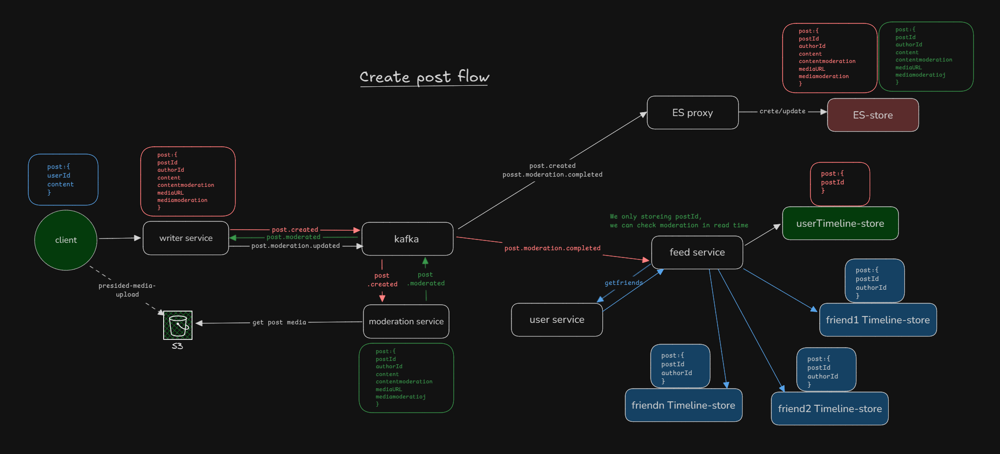

**Overview:**
The create post flow handles user-generated content creation, moderation, and distribution to user timelines.

**Notes:**
- Only `postId` is stored in timelines; full post data retrieved on read
- Moderation happens asynchronously to improve write performance
- Failed moderation doesn't block timeline distribution

---

### Get Feed Flow

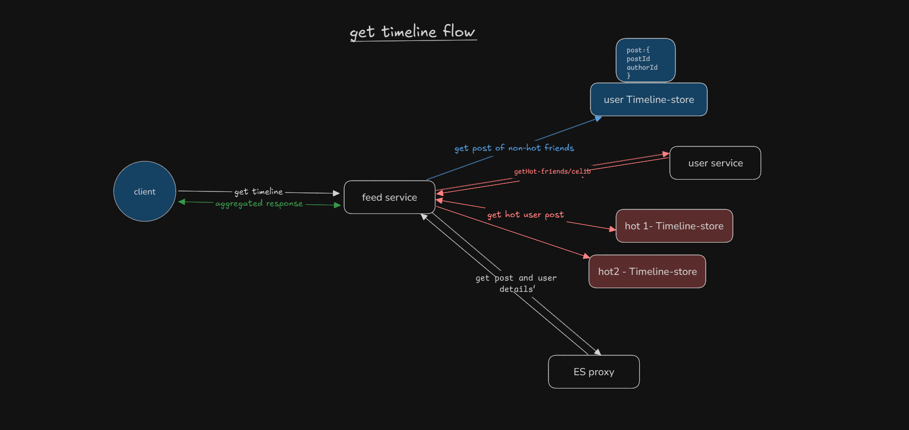

**Overview:**
The get feed flow retrieves and aggregates posts from multiple sources to create a personalized user feed.

**Data Flow Steps:**

1. **Client Request**
   - User requests their feed
   - Request sent to **Feed Service**

2. **Timeline Retrieval**
   - Feed Service queries **User Timeline Store** for postIds
   - Returns paginated list of postIds with timestamps

3. **Friend Content Aggregation**
   - Feed Service queries **User Service** to get user's friends list
   - Categorizes friends as:
     - **Hot friends** (high follower count/engagement)
     - **Regular friends**

4. **Hot User Content**
   - For each hot friend/celebrity:
     - Queries their **Timeline Store**
     - Retrieves recent postIds
   - Aggregates hot user posts

5. **Regular Friend Content**
   - For non-hot friends:
     - Queries their **Timeline Stores**
     - Retrieves recent postIds
   - Aggregates regular friend posts

6. **Post Details Enrichment**
   - Feed Service queries **ES Proxy** with collected postIds
   - ES Proxy retrieves full post details from **Elasticsearch**:
     - Post content
     - Author information
     - Metadata (likes, comments, timestamps)
     - Moderation status

7. **Response Aggregation**
   - Feed Service merges and sorts posts:
     - By timestamp (most recent first)
     - By engagement score (for hot content)
   - Applies pagination
   - Returns aggregated response to client

**Performance Optimizations:**
- Timeline queries are fast (pre-computed postIds)
- Parallel fetching of hot vs regular friend content
- Bulk post detail retrieval from ES
- Caching of hot friend lists

---

### Create Comment Flow

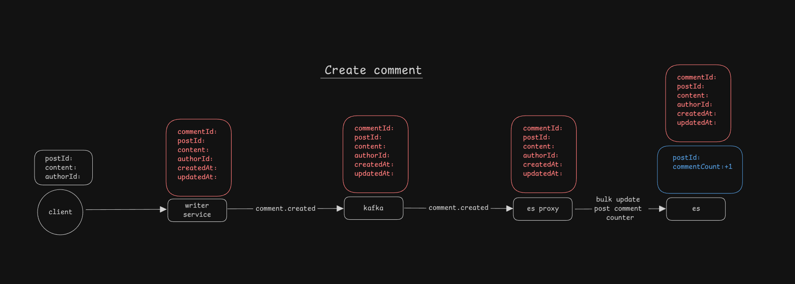

**Overview:**
The create comment flow handles comment creation on posts, including rewards and search indexing.

### Fetch Post Comments Flow

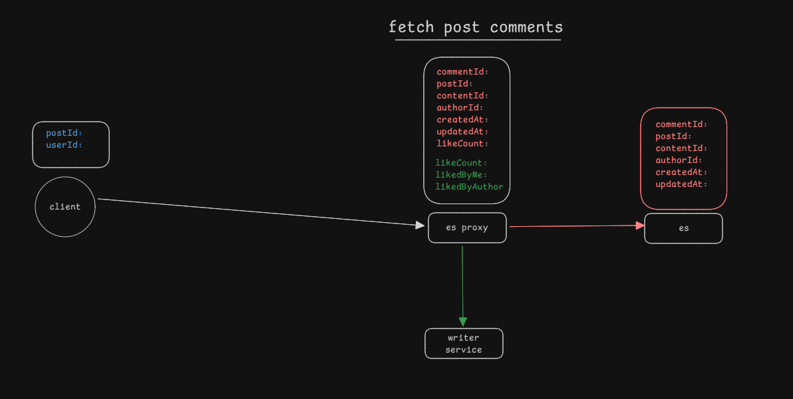

**Overview:**
Retrieves all comments for a specific post with enriched metadata (likes, author info).

---

### Like a Comment Flow

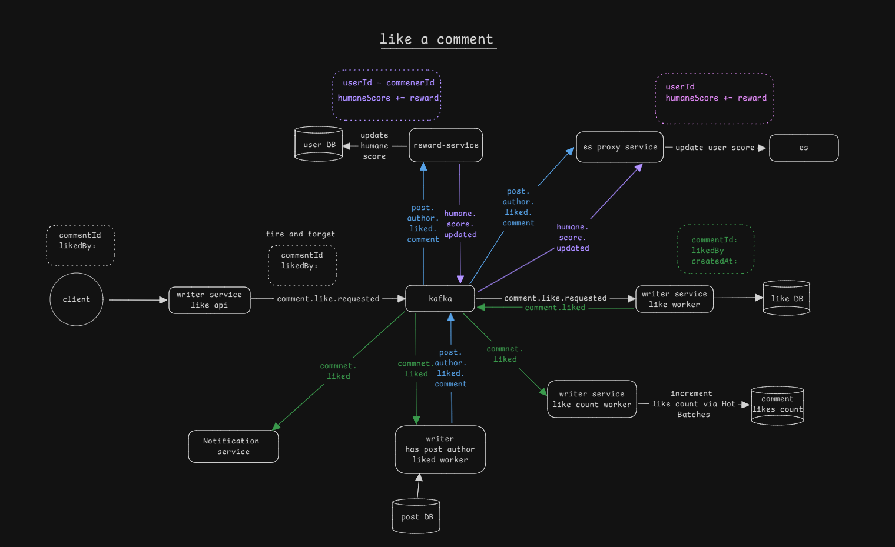

**Overview:**
Handles liking/unliking comments with async processing for counts and notifications.

---

## Real-time Communication Flows

### WebSocket Connection Flow

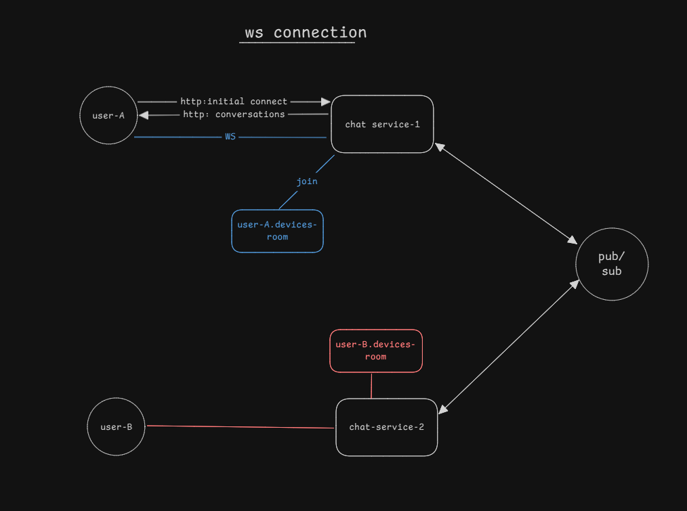

**Overview:**
Manages WebSocket connections and user presence across multiple devices.
tes last seen timestamp

---

### Send Message Flow

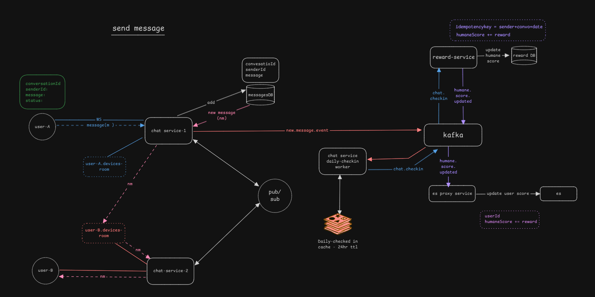

**Overview:**
Handles real-time message delivery between users with persistence and delivery tracking.

---

### Typing Indicator Flow

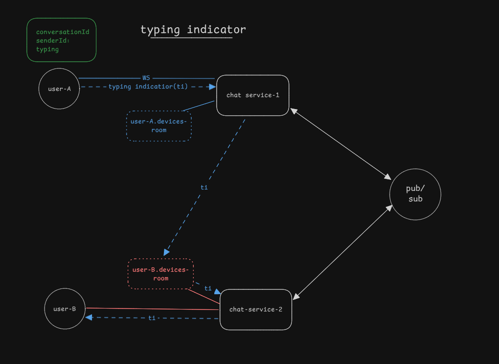

**Overview:**
Provides real-time typing indicators to show when users are composing messages.

**Data Flow Steps:**

1. **User Starts Typing**
   - Client detects keystroke events (debounced)
   - Emits `typing_start` event with `chatId`, `userId`, `timestamp`

2. **Server Broadcast**
   - Chat Service validates user in chat
   - Broadcasts `user_typing` to room `chat:{chatId}` (excludes sender)

3. **Client UI Update**
   - Recipients display typing indicator: "John is typing..."

4. **Indicator Removal**
   - No explicit typing stop event needed
   - Clients clear indicator after timeout period without new `typing_start` events

---

### Is Online Flow

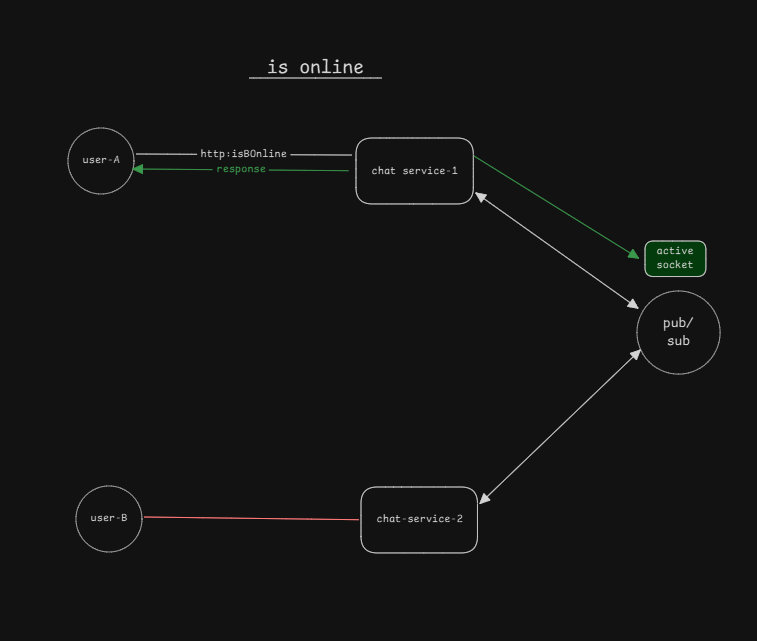

**Overview:**
Tracks and broadcasts user online/offline status to contacts in real-time.

**Scalability Considerations:**
- Redis pub/sub for presence events
- Batch presence checks
- Cache friend lists
- Horizontal scaling of Chat Service (sticky sessions or shared Redis)

---

### Call Initiation Flow

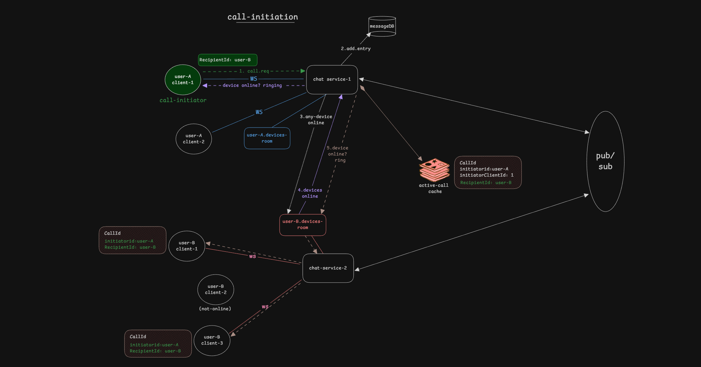

**Overview:**
Handles the initiation of voice/video calls between users with signaling and presence validation.

---

### Accept Call Flow

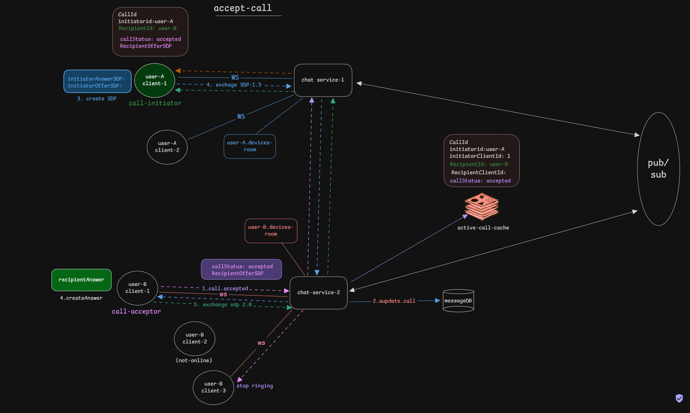

**Overview:**
Handles the recipient accepting an incoming call and establishing the WebRTC peer connection.

---

## System Architecture

**Overview:**
High-level architecture of the Humane backend system showing service interactions and data flow.

### Core Services

1. **Writer Service**
   - Handles all write operations (posts, comments, likes)
   - Publishes events to Kafka
   - Multiple workers for async processing:
     - Like Count Worker
     - Has Post Author Liked Worker
   - Tech: Node.js/TypeScript, PostgreSQL (primary writes)

2. **Feed Service**
   - Aggregates and serves user feeds
   - Consumes events for timeline updates
   - Queries multiple timeline stores
   - Tech: Node.js/TypeScript, Redis (timeline storage)

3. **Chat Service**
   - WebSocket server for real-time communication
   - Handles messaging, typing indicators, presence
   - Tech: Node.js/TypeScript, Socket.io/WS, Redis (pub/sub)

4. **User Service**
   - User authentication and authorization
   - Friend relationships and social graph
   - User profiles and preferences
   - Tech: Node.js/TypeScript, PostgreSQL

5. **Moderation Service**
   - Content moderation (text and media)
   - ML-based classification
   - Manual review queue
   - Tech: Python, ML models, PostgreSQL

6. **Notification Service**
   - Push notifications
   - Email notifications
   - In-app notifications
   - Tech: Node.js/TypeScript, FCM/APNs, email service

7. **Reward Service**
   - Gamification and humane score tracking
   - Reward calculation and distribution
   - Leaderboards
   - Tech: Node.js/TypeScript, PostgreSQL

8. **ES Proxy**
   - Elasticsearch interface
   - Consumes events for indexing
   - Query optimization
   - Tech: Node.js/TypeScript, Elasticsearch

### Data Stores

1. **PostgreSQL**
   - Primary database for:
     - Users
     - Posts (metadata)
     - Comments
     - Relationships
   - Multiple instances (per service)

2. **MongoDB**
   - Document storage for:
     - Chat messages
     - Rich user profiles
     - Moderation history
   - Replica set for HA

3. **Redis**
   - Caching layer
   - Timeline stores
   - Presence tracking
   - Session management
   - Pub/sub for real-time features

4. **Elasticsearch**
   - Full-text search for:
     - Posts
     - Comments
     - Users
   - Analytics and aggregations

5. **S3 (Object Storage)**
   - Media files (images, videos)
   - Presigned URLs for uploads
   - CDN integration

### Message Broker

**Kafka**
- Event streaming platform
- Enables async, decoupled architecture
- Event sourcing and replay capability

### Infrastructure

1. **Kubernetes (K8s)**
   - Container orchestration
   - Service discovery
   - Auto-scaling
   - Configuration: `infra/k8s/`

2. **Skaffold**
   - Local development workflow
   - CI/CD integration
   - Configs: `skaffold.yaml`, `skaffold.prod.yaml`

3. **Load Balancers**
   - Nginx Ingress Controller
   - Routes traffic to services
   - SSL termination

### Communication Patterns

1. **Synchronous (HTTP/REST)**
   - Client ↔ Services
   - Service ↔ Service (when immediate response needed)
   - Examples: API requests, user queries

2. **Asynchronous (Kafka Events)**
   - Service → Kafka → Service(s)
   - Examples: Post creation, moderation, indexing
   - Benefits: Decoupling, resilience, scalability

3. **Real-time (WebSocket)**
   - Client ↔ Chat Service
   - Examples: Messages, typing indicators, presence
   - Bidirectional, persistent connections

4. **Caching**
   - Redis for frequently accessed data
   - Reduces database load
   - Improves response times

### Security

- **Authentication**: JWT tokens
- **Authorization**: Role-based access control (RBAC)
- **Rate Limiting**: Per-user, per-endpoint
- **Data Encryption**: TLS in transit, encryption at rest
- **Secret Management**: Kubernetes secrets, environment variables

### Monitoring & Observability

- **Logging**: Centralized logging (Grafana + Loki)
- **Metrics**: Prometheus + Grafana
- **Health Checks**: Kubernetes liveness/readiness probes

### Scalability Strategies

1. **Horizontal Scaling**
   - Stateless services (Writer, Feed, etc.)
   - Kubernetes auto-scaling

2. **Database Sharding**
   - Shard by userId for timelines
   - Shard by postId for posts

3. **Caching**
   - Redis for hot data
   - CDN for static assets

4. **Read Replicas**
   - PostgreSQL read replicas for queries
   - Reduce load on primary

5. **Event-Driven Architecture**
   - Kafka for async processing
   - Decouples services
   - Enables independent scaling

---

## Additional Notes

### Media Upload Flow
- Client requests presigned S3 URL from Writer Service
- Client uploads directly to S3
- S3 URL included in post/comment creation
- Moderation Service validates media asynchronously

### Data Consistency
- **Strong Consistency**: Write operations (posts, comments)
- **Eventual Consistency**: Timeline distribution, search indexing
- **Conflict Resolution**: Last-write-wins for updates

---

*For more detailed information on specific services, refer to individual service README files in their respective directories.*

